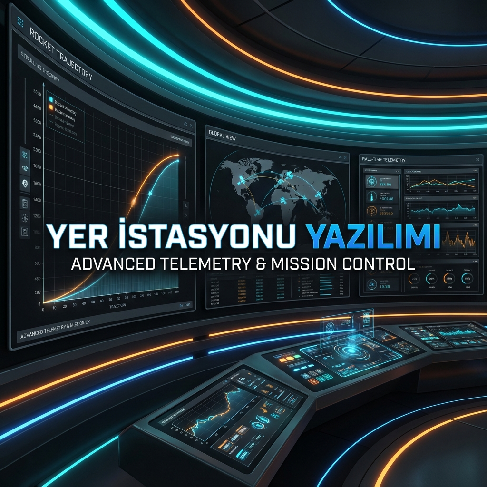

# Yer İstasyonu Yazılımı (Ground Station)




## 📌 Hakkında
Bu proje, **Teknofest Roket Yarışması** kapsamında geliştirilen roketin uçuş verilerini (telemetri) anlık olarak almak, görselleştirmek ve kaydetmek için tasarlanmış bir yer istasyonu yazılımıdır.

**Özellikler:**
- 📡 **Seri Haberleşme**: XBee/LoRa modülleri üzerinden gelen veriyi okuma (COM Port seçimi).
- 📊 **Canlı Grafikler**: İrtifa, Hız, İvme ve Sıcaklık verilerinin zaman serisi grafikleri.
- 🗺️ **Harita Konumlandırma**: GPS verilerini (Enlem/Boylam) görselleştirme.
- 💾 **Veri Kaydı**: Uçuş verilerini CSV formatında kaydetme.
- 🚀 **Durum Takibi**: Roket durumunu (Rampa, Yükselme, Paraşüt Açma, İniş) izleme.

## 🛠 Gereksinimler
Yazılımın çalışması için aşağıdaki Python kütüphanelerine ihtiyacınız vardır:
- `PyQt5`: Grafik Arayüz (GUI)
- `pyserial`: Seri Port haberleşmesi
- `matplotlib` / `pyqtgraph`: Grafik çizimi

## 📥 Kurulum & Çalıştırma

1. **Repoyu Klonlayın**:
   ```bash
   git clone https://github.com/bahattinyunus/Teknofest_roket_Yer_istasyonu_yazilimi.git
   cd Teknofest_roket_Yer_istasyonu_yazilimi
   ```

2. **Bağımlılıkları Yükleyin**:
   ```bash
   pip install -r requirements.txt
   ```

3. **Uygulamayı Başlatın**:
   ```bash
   python yeristasyonu.py
   ```

## 🤝 Katkıda Bulunma
Katkılarınızı bekliyoruz! Arayüz geliştirmeleri veya yeni grafik özellikleri eklemek isterseniz lütfen `CONTRIBUTING.md` dosyasını okuyun.

## 📄 Lisans
Bu proje **MIT Lisansı** ile lisanslanmıştır. Detaylar için `LICENSE` dosyasına bakabilirsiniz.
